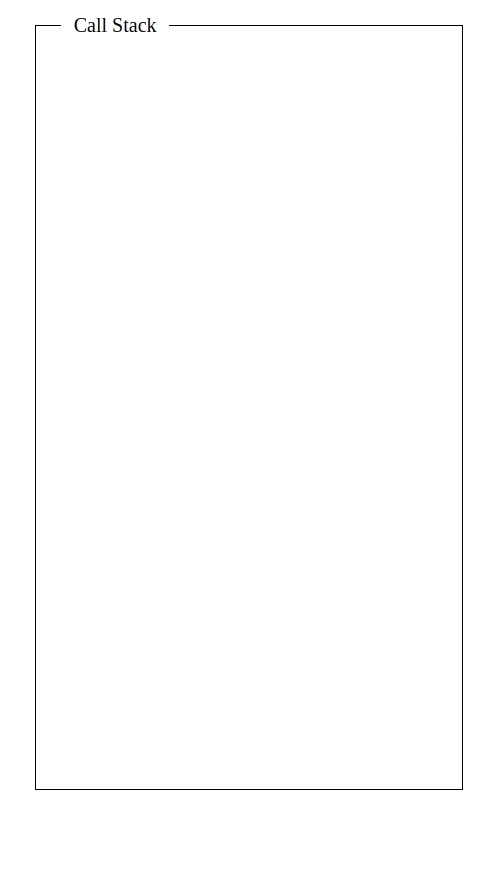

# js-event-loop

Let's make a "To-Do" list:

- [ ] Dry clean socks (1hr)
- [ ] Wash underpants (1hr)
- [ ] Get TA's birthday cake (1hr 45min)
- [ ] Get nails did (1hr)
- [ ] Contour face (45min)
- [ ] Attend birthday party at 12pm (3hr)

To keep the class informed on what job I'm working on, I've created a 'Current Job' list:

## 8am

To-Do list:

- [ ] Dry clean socks (1hr)
- [ ] Wash underpants (1hr)
- [ ] Get TA's birthday cake (1hr 45min)
- [ ] Get nails did (1hr)
- [ ] Contour face (45min)
- [ ] Attend birthday party at 12pm (3hr)

Current Job:

- Dry clean socks

## 9am

To-Do list:

- [x] Dry clean socks (1hr)
- [ ] Wash underpants (1hr)
- [ ] Get TA's birthday cake (1hr 45min)
- [ ] Get nails did (1hr)
- [ ] Contour face (45min)
- [ ] Attend birthday party at 12pm (3hr)

Current Job:

- Wash underpants

## 10am

To-Do list:

- [x] Dry clean socks (1hr)
- [x] Wash underpants (1hr)
- [ ] Get TA's birthday cake (1hr 45min)
- [ ] Get nails did (1hr)
- [ ] Contour face (45min)
- [ ] Attend birthday party at 12pm (3hr)

Current Job:

- Get TA's birthday cake

## 11.45am

To-Do list:

- [x] Dry clean socks (1hr)
- [x] Wash underpants (1hr)
- [x] Get TA's birthday cake (1hr 45min)
- [ ] Get nails did (1hr)
- [ ] Contour face (45min)
- [ ] Attend birthday party at 12pm (3hr)

Current Job:

- Get nails did

## 12.45pm

To-Do list:

- [x] Dry clean socks (1hr)
- [x] Wash underpants (1hr)
- [x] Get TA's birthday cake (1hr 45min)
- [x] Get nails did (1hr)
- [ ] Contour face ( 45min)
- [ ] Attend birthday party at 12pm (3hr)

Current Job:

- Contour face

## 1.30pm

To-Do list:

- [x] Dry clean socks (1hr)
- [x] Wash underpants (1hr)
- [x] Get TA's birthday cake (1hr 45min)
- [x] Get nails did (1hr)
- [x] Contour face (45min)
- [ ] Attend birthday party at 12pm (3hr)

Current Job:

- Attend birthday party at 12pm

We are late - it's 1:30pm when we arrive at the party! Robyn will be pissed...

## 3.00pm

To-Do list:

- [x] Dry clean socks (1hr)
- [x] Wash underpants (1hr)
- [x] Get TA's birthday cake (1hr 45min)
- [x] Get nails did (1hr)
- [x] Contour face (45min)
- [x] Attend birthday party at 12pm (3hr)

Current Job:

- N/A

Our priority is to get to the party on time, so let's revisit our scheduling

## 8am

To-Do list:

- [ ] Dry clean socks (1hr)
- [ ] Wash underpants (1hr)
- [ ] Get TA's birthday cake (1hr 45min)
- [ ] Get nails did (1hr)
- [ ] Contour face (45min)
- [ ] Attend birthday party at 12pm (3hr)

Current Job:

- Dry clean socks

## 9am

- [x] Dry clean socks (1hr)
- [ ] Wash underpants (1hr)
- [ ] Get TA's birthday cake (1hr 45min)
- [ ] Get nails did (1hr)
- [ ] Contour face (45min)
- [ ] Attend birthday party at 12pm (3hr)

Current Job:

- Get TA's birthday cake

## 10.45am

- [x] Dry clean socks (1hr)
- [ ] Wash underpants (1hr)
- [x] Get TA's birthday cake (1hr 45min)
- [ ] Get nails did (1hr)
- [ ] Contour face (45min)
- [ ] Attend birthday party at 12pm (3hr)

Current Job:

- Contour face

## 11.30am

- [x] Dry clean socks (1hr)
- [ ] Wash underpants (1hr)
- [x] Get TA's birthday cake (1hr 45min)
- [ ] Get nails did (1hr)
- [x] Contour face (45min)
- [ ] Attend birthday party at 12pm (3hr)

Current Job:

- N/A

## 12.00pm

- [x] Dry clean socks (1hr)
- [ ] Wash underpants (1hr)
- [x] Get TA's birthday cake (1hr 45min)
- [ ] Get nails did (1hr)
- [x] Contour face (45min)
- [ ] Attend birthday party at 12pm (3hr)

Current Job:

- Attend birthday party at 12pm

## 3.00pm

- [x] Dry clean socks (1hr)
- [ ] Wash underpants (1hr)
- [x] Get TA's birthday cake (1hr 45min)
- [ ] Get nails did (1hr)
- [x] Contour face (45min)
- [x] Attend birthday party at 12pm (3hr)

Current Job:

- Get nails did

## 4.00pm

- [x] Dry clean socks (1hr)
- [ ] Wash underpants (1hr)
- [x] Get TA's birthday cake (1hr 45min)
- [x] Get nails did (1hr)
- [x] Contour face (45min)
- [x] Attend birthday party at 12pm (3hr)

Current Job:

- Wash underpants

## 5.00pm

- [x] Dry clean socks (1hr)
- [x] Wash underpants (1hr)
- [x] Get TA's birthday cake (1hr 45min)
- [x] Get nails did (1hr)
- [x] Contour face (45min)
- [x] Attend birthday party at 12pm (3hr)

Current Job:

- N/A

Done for the day! But it's late, we've come home from the party to do chores for 2 hours. Not happy Jan :(

We are wasting time waiting for our dry cleaning and the cake to be done. There was no time after contouring our face to do our nails, so we just sat around for 30mins before the party. We need a better way to organise our day.

Instead of waiting around for our dry cleaning and cake to be ready, we can ask the dry cleaners and bakery to text us when the items are ready to be collected. There are two benefits to this approach:

1. While we are waiting for the dry cleaning to be done and the cake to be ready, we can work on other jobs on our to-do list.
2. We have the freedom to decide when we should pick up our dry cleaning and our cake.

## 8am

To-Do list:

- [ ] Dry clean socks (1hr)
- [ ] Wash underpants (1hr)
- [ ] Get TA's birthday cake (1hr 45min)
- [ ] Get nails did (1hr)
- [ ] Contour face (45min)
- [ ] Attend birthday party at 12pm (3hr)

Current Job:

- Dry clean socks

## 8.05am

To-Do list:

- [x] Dry clean socks (1hr)
- [ ] Wash underpants (1hr)
- [ ] Get TA's birthday cake (1hr 45min)
- [ ] Get nails did (1hr)
- [ ] Contour face (45min)
- [ ] Attend birthday party at 12pm (3hr)

Current Job:

- Get TA's birthday cake

## 8.10am

To-Do list:

- [x] Dry clean socks (1hr)
- [ ] Wash underpants (1hr)
- [x] Get TA's birthday cake (1hr 45min)
- [ ] Get nails did (1hr)
- [ ] Contour face (45min)
- [ ] Attend birthday party at 12pm (3hr)

Current Job:

- Wash underpants

## 9.00am

We get a message saying that our dry cleaning is done. We decide to finish washing our underpants and pick dry cleaning after the cake is ready.

To-Do list:

- [x] Dry clean socks (1hr)
- [ ] Wash underpants (1hr)
- [x] Get TA's birthday cake (1hr 45min)
- [ ] Get nails did (1hr)
- [ ] Contour face (45min)
- [ ] Attend birthday party at 12pm (3hr)

Current Job:

- Wash underpants

## 9.10am

To-Do list:

- [x] Dry clean socks (1hr)
- [x] Wash underpants (1hr)
- [x] Get TA's birthday cake (1hr 45min)
- [ ] Get nails did (1hr)
- [ ] Contour face (45min)
- [ ] Attend birthday party at 12pm (3hr)

Current Job:

- Contour face

## 9.50am

We receive another message saying that our cake is ready. We decide to finish contouring our face and get our nails did before we pick up the dry cleaning and the cake.

To-Do list:

- [x] Dry clean socks (1hr)
- [x] Wash underpants (1hr)
- [x] Get TA's birthday cake (1hr 45min)
- [ ] Get nails did (1hr)
- [ ] Contour face (45min)
- [ ] Attend birthday party at 12pm (3hr)

Current Job:

- Contour face

## 9.55am

To-Do list:

- [x] Dry clean socks (1hr)
- [x] Wash underpants (1hr)
- [x] Get TA's birthday cake (1hr 45min)
- [ ] Get nails did (1hr)
- [x] Contour face (45min)
- [ ] Attend birthday party at 12pm (3hr)

Current Job:

- Get nails did

## 10.55am

Time to pick up dry cleaning and cake! Then we can relax until the party.

To-Do list:

- [x] Dry clean socks (1hr)
- [x] Wash underpants (1hr)
- [x] Get TA's birthday cake (1hr 45min)
- [x] Get nails did (1hr)
- [x] Contour face (45min)
- [ ] Attend birthday party at 12pm (3hr)

Current Job:

- N/A

## 12.00pm

To-Do list:

- [x] Dry clean socks (1hr)
- [x] Wash underpants (1hr)
- [x] Get TA's birthday cake (1hr 45min)
- [x] Get nails did (1hr)
- [x] Contour face (45min)
- [ ] Attend birthday party at 12pm (3hr)

Current Job:

- Attend birthday party at 12pm

## 3.00pm

To-Do list:

- [x] Dry clean socks (1hr)
- [x] Wash underpants (1hr)
- [x] Get TA's birthday cake (1hr 45min)
- [x] Get nails did (1hr)
- [x] Contour face (45min)
- [x] Attend birthday party at 12pm (3hr)

Current Job:

- N/A

We get home at 3.00pm, with all our chores done, and no pissed off Robyn - what a win!

We can think of the original todo list as a list of functions that need to be executed. In this example, if the original todo list is a list of functions, then the `current job` is the `call stack`.

Because the JS engine is single threaded, only one job (or function) can be executed at a time. When we call a function, this results in a new item being added to the call stack. The item is then "popped off" the call stack once it has finished executing.

If a function invokes another function, then another item is aded to the call stack. Consider the functions defined below:

```js
function dryCleanSocks() {
  return washUnderpants();
}
function washUnderpants() {
  return getTAsBirthdayCake();
}
function getTAsBirthdayCake() {
  return getNailsDid();
}
function getNailsDid() {
  return contourFace();
}
function contourFace() {
  return attendBirthdayParty();
}
function attendBirthdayParty() {
  return `🥳 🎈 🎉 🥰 🎊 🎁`;
}

dryCleanSocks();
```

What does this look like on the call stack?



In our previous example, if each job on the todo list was a function and the 'current job' was the call stack then we (the person carrying out the jobs) are the JS execution engine.

Our job is to execute each job on the todo list by placing it on the 'current job' list (a.k.a. the call stack). Much like the JS engine, we can only execute a single job at a time. Our call stack would look something like this:


As we found earlier, working on a single job at a time was not very efficient. We wasted time waiting for jobs to complete, when we could have been working on other jobs in the meantime. In some cases, it makes sense to work on jobs asynchronously, when possible. There are two important aspects that made it possible to work asynchronously:

1 - We were able to rely on a 3rd party service, external to ourselves when it came to doing the dry cleaning and preparing a cake. In Node, these are C++ APIs and in the browser, they are the Web APIs.
2 - The external services were able to notify us once they had completed the jobs delegated to them. This allowed us to decided when to pick up our dry cleaning and cake. When a C++ API (Node) or a Web API (Browser) complete a job, they notify the JS engine by pushing the callback function given to them onto something called the 'task queue'.

So in our analogy we have the following mapping:

```text
+----------------------+----------------------+
|          Us          |   Javascript Engine  |
+----------------------+----------------------+
| Todo List            |  Functions           |
| Text Inbox           |  Task Queue          |
| Current Job          |  Call Stack          |
| Async Todo List Item |  C++ APIs / Web APIs |
+----------------------+----------------------+
```

So how does a function get from the 'task queue' to the 'call stack'? In our example, we didn't pick up our cake or dry cleaning until we had completed our previous task (contouring our face). The same behaviour applies to the JS engine. When the call stack is empty, then and only then, will the JS engine check the task queue to see if there are any functions waiting to be executed. If there are, then they will be pushed onto the call stack.

```javascript
let callStack = []
let taskQueue = []
while(true){
  if(callStack.length === 0 && taskQueue.length > 0){
    callStack.push(taskQueue.shift())
  }
}
```

## Loupe examples

```js
console.log("Wash underpants");

setTimeout(function timeout() {
    console.log("Dry clean socks");
}, 2000);

console.log("Get nails did");
```

```js
console.log("Wash underpants");

setTimeout(function timeout() {
    console.log("Dry clean socks");
}, 0);

console.log("Get nails did");
```

```js
console.log("Wash underpants");

setTimeout(function timeout() {
    console.log("Dry clean socks");
}, 0);

new Promise(function(resolve) {resolve('getTAsBirthdayCake')}).then(console.log) 

console.log("Get nails did");
```

[loupe.js](http://latentflip.com/loupe/?code=JC5vbignYnV0dG9uJywgJ2NsaWNrJywgZnVuY3Rpb24gb25DbGljaygpIHsKICAgIHNldFRpbWVvdXQoZnVuY3Rpb24gdGltZXIoKSB7CiAgICAgICAgY29uc29sZS5sb2coJ1lvdSBjbGlja2VkIHRoZSBidXR0b24hJyk7ICAgIAogICAgfSwgMjAwMCk7Cn0pOwoKY29uc29sZS5sb2coIkhpISIpOwoKc2V0VGltZW91dChmdW5jdGlvbiB0aW1lb3V0KCkgewogICAgY29uc29sZS5sb2coIkNsaWNrIHRoZSBidXR0b24hIik7Cn0sIDUwMDApOwoKY29uc29sZS5sb2coIldlbGNvbWUgdG8gbG91cGUuIik7!!!PGJ1dHRvbj5DbGljayBtZSE8L2J1dHRvbj4%3D)
